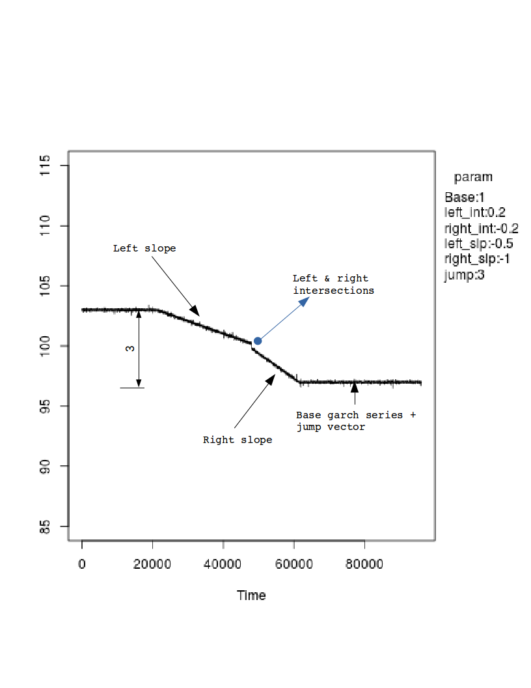
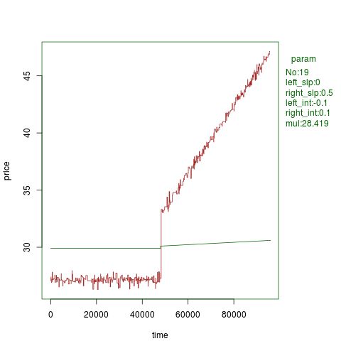
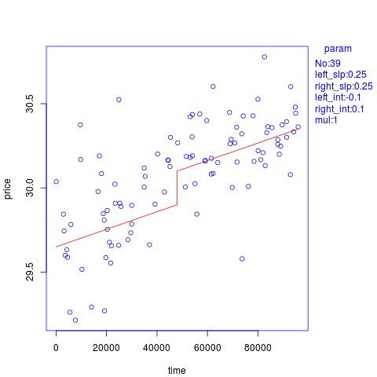
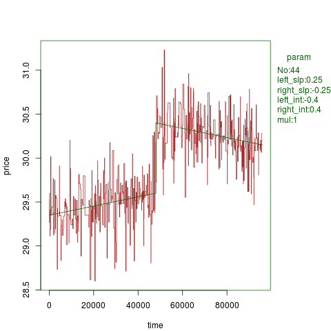

# Time-Series-Simulations

During my summer internship at [AcquireMedia Inc.](http://www.acquiremedia.com/), Roseland, NJ, I worked on some internal projects.
This script belongs to one of the projects. I tried simulating time series based on [GARCH](https://en.wikipedia.org/wiki/Autoregressive_conditional_heteroskedasticity) coefficient(statistical)
alpha and beta. Look into img folder for some sample plots. Script has many variables that can be chosen accordingly to generate simulation with base series and jump vector added.

Following image has example of parameters that can be used to create different simulations.

