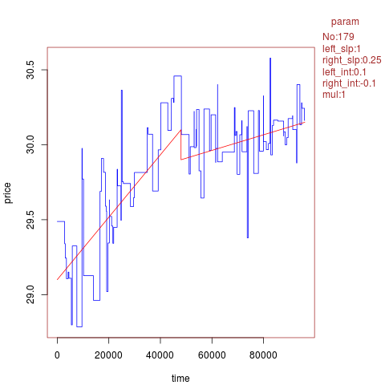

# Time-Series-Simulations

During my summer internship at [AcquireMedia Inc.](http://www.acquiremedia.com/), Roseland, NJ, I worked on some internal projects.
This repository belongs to one of the project. I tried simulating time series based on [GARCH](https://en.wikipedia.org/wiki/Autoregressive_conditional_heteroskedasticity) coefficients(statistical)
alpha and beta. It can also use [Cauchy](https://en.wikipedia.org/wiki/Cauchy_distribution) distibution as base series. Look into img folder for some sample plots. These R Scripts has many parameters that can be chosen accordingly to generate simulation with base series and jump vector added.

I implemented this for generating simulations for numerical change-point detector algorithm in time-series data. Also, I used [adaptive staircase procedure ](https://en.wikipedia.org/wiki/Psychophysics#Adaptive_psychophysical_methods) to find minimum magnitude for which detector reports Jump. Following image has example of parameters that can be varied to create different simulations.

 
 

